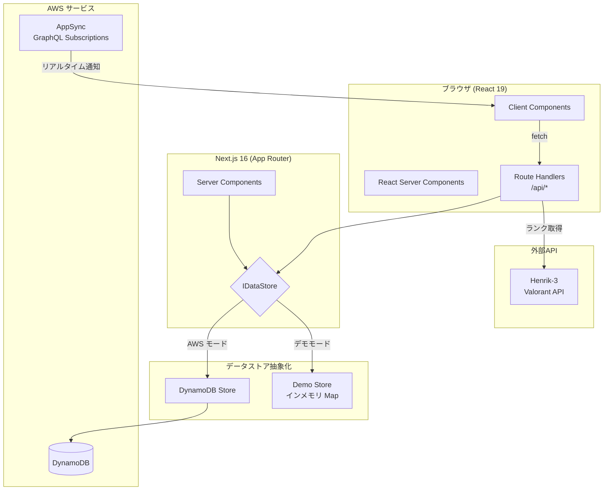
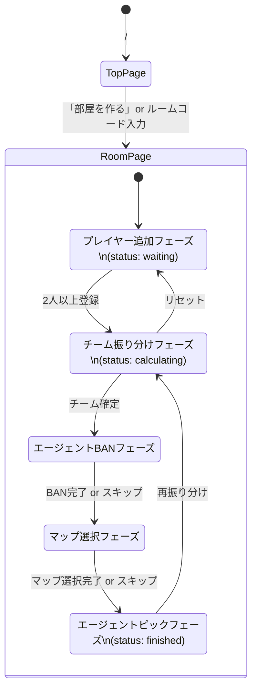
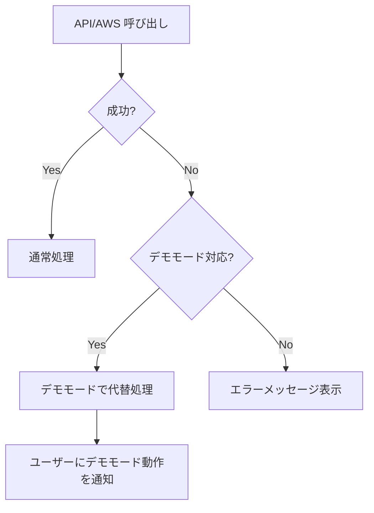

# 技術設計書 — VALORANT Custom Team Builder

## 概要

VALORANT Custom Team Builder は、VALORANTカスタムマッチ向けの公平なチーム分け支援Webアプリケーションである。ホストがルームを作成しURLを共有するだけで参加者が集まり、ランク情報に基づいた自動バランス振り分け、エージェントBAN/ピック、マップ選択までをワンストップで提供する。

技術的には Next.js 16 (App Router) をフロントエンド/BFFとして使用し、バックエンドは AWS マネージドサービス（DynamoDB, AppSync, Lambda）で構成する。外部API未接続・AWS未構成でもデモモードで完全動作するデュアルモード設計を採用する。

### 設計方針

- **サーバーサイド優先**: Next.js App Router の Server Components / Route Handlers を活用し、データ取得・ビジネスロジックをサーバーサイドで実行
- **デュアルモード**: 環境変数の有無のみで AWS モード / デモモードを自動切替。共通インターフェースによるストア抽象化
- **クライアント最小化**: クライアントサイドは UI インタラクション（D&D、アニメーション、投票UI）に限定
- **型安全**: TypeScript の厳密な型定義でドメインモデルからAPI境界まで一貫した型安全性を確保

## アーキテクチャ

### システム構成図



### ディレクトリ構成

```
src/
├── app/                          # Next.js App Router
│   ├── layout.tsx                # ルートレイアウト（ダークテーマ）
│   ├── page.tsx                  # トップページ（ルーム作成・参加）
│   ├── room/
│   │   └── [roomId]/
│   │       └── page.tsx          # ルーム画面（メイン）
│   └── api/
│       ├── rooms/
│       │   ├── route.ts          # POST: ルーム作成
│       │   └── [roomId]/
│       │       └── route.ts      # GET/POST/PATCH/DELETE
│       └── valorant/
│           └── route.ts          # GET: Valorant API プロキシ
├── lib/
│   ├── store/
│   │   ├── interface.ts          # IDataStore インターフェース
│   │   ├── dynamodb-store.ts     # DynamoDB 実装
│   │   ├── demo-store.ts         # インメモリ実装
│   │   └── index.ts              # ストアファクトリ（環境変数で切替）
│   ├── algorithms/
│   │   ├── team-allocator.ts     # チーム振り分け（4モード）
│   │   └── agent-picker.ts       # エージェントピック（Tier考慮/シンプル）
│   ├── valorant-api.ts           # Henrik-3 API クライアント
│   ├── constants/
│   │   ├── agents.ts             # エージェント定数（31体）
│   │   ├── maps.ts               # マップ定数（11種）
│   │   └── ranks.ts              # ランク定数（25段階）
│   └── types.ts                  # 共通型定義
├── components/
│   ├── ui/                       # 汎用UIコンポーネント（Radix UI ベース）
│   │   ├── button.tsx
│   │   ├── badge.tsx
│   │   ├── card.tsx
│   │   ├── input.tsx
│   │   └── label.tsx
│   ├── room/
│   │   ├── player-form.tsx       # プレイヤー追加フォーム
│   │   ├── player-list.tsx       # プレイヤー一覧
│   │   ├── player-card.tsx       # プレイヤーカード
│   │   ├── team-display.tsx      # チーム振り分け結果
│   │   ├── draft-mode.tsx        # ドラフトモードUI
│   │   └── manual-mode.tsx       # 手動振り分けUI（D&D）
│   ├── agent/
│   │   ├── agent-icon.tsx        # エージェントアイコン（sm/md/lg）
│   │   ├── agent-badge.tsx       # エージェントバッジ
│   │   ├── ban-panel.tsx         # BANモードUI
│   │   ├── pick-result.tsx       # ピック結果表示
│   │   └── tier-editor.tsx       # Tier編集UI
│   └── map/
│       ├── map-random.tsx        # マップランダム選択
│       └── map-vote.tsx          # マップ投票UI
└── hooks/
    ├── use-room.ts               # ルームデータ管理
    ├── use-appsync.ts            # AppSync リアルタイム同期
    └── use-agent-tier.ts         # エージェントTier（localStorage）
```


### 画面遷移フロー



## コンポーネントとインターフェース

### データストアインターフェース（IDataStore）

AWS モードとデモモードの切替を透過的に行うための共通インターフェース。

```typescript
interface IDataStore {
  // ルーム操作
  createRoom(): Promise<Room>;
  getRoom(roomId: string): Promise<Room | null>;
  updateRoomStatus(roomId: string, status: RoomStatus): Promise<void>;
  updateRoomRankMode(roomId: string, rankMode: RankMode): Promise<void>;
  deleteRoom(roomId: string): Promise<void>;

  // プレイヤー操作
  addPlayer(roomId: string, player: PlayerInput): Promise<Player>;
  getPlayers(roomId: string): Promise<Player[]>;
  deletePlayer(roomId: string, playerId: string): Promise<void>;
  updatePlayerTeam(roomId: string, playerId: string, team: Team): Promise<void>;
  resetTeams(roomId: string): Promise<void>;

  // クリーンアップ
  cleanupExpiredRooms(): Promise<void>;
}
```

### ストアファクトリ

```typescript
// lib/store/index.ts
function getStore(): IDataStore {
  if (process.env.AWS_REGION && process.env.DYNAMODB_ROOMS_TABLE_NAME) {
    return new DynamoDBStore();
  }
  return DemoStore.getInstance(); // globalThis でシングルトン管理
}
```

### Team_Allocator インターフェース

```typescript
interface TeamResult {
  teamA: Player[];
  teamB: Player[];
  teamATotal: number;
  teamBTotal: number;
  difference: number;
}

// 自動バランス（動的計画法）
function autoBalance(players: Player[], rankMode: RankMode): TeamResult;

// ランダム（Fisher-Yates）
function randomSplit(players: Player[]): TeamResult;

// ドラフトモード用ユーティリティ
function resolveDraftConflict(pick: Player): { winner: 'A' | 'B' };
function assignLastPlayer(unassigned: Player, teamA: Player[], teamB: Player[]): Team;
```

### Agent_System インターフェース

```typescript
interface AgentPickResult {
  playerId: string;
  agent: Agent;
}

// Tier考慮ランダムピック
function tierAwareRandomPick(
  teamA: Player[], teamB: Player[],
  bannedAgentIds: string[],
  mapId: string,
  tierData: MapTierData
): AgentPickResult[];

// シンプルランダムピック
function simpleRandomPick(
  players: Player[],
  bannedAgentIds: string[]
): AgentPickResult[];

// 個別リロール
function rerollAgent(
  playerId: string,
  currentPicks: AgentPickResult[],
  bannedAgentIds: string[],
  mapId: string | null,
  tierData: MapTierData | null
): AgentPickResult;
```

### Rank_Resolver インターフェース

```typescript
interface ValorantPlayerInfo {
  name: string;
  tag: string;
  displayName: string;
  rank: string;
  rankValue: number;
  peakRank: string;
  peakRankValue: number;
}

// Henrik-3 API 経由でプレイヤー情報取得（失敗時はデモモードフォールバック）
async function resolveRank(name: string, tag: string): Promise<ValorantPlayerInfo>;
```

### Map_Selector インターフェース

```typescript
// ランダム選択
function randomMapSelect(maps: MapData[]): MapData;

// 投票結果からマップ選択（同票時ランダム）
function resolveMapVote(votes: Record<string, string[]>): MapData;
```


## データモデル

### 型定義

```typescript
// === ルーム ===
type RoomStatus = 'waiting' | 'calculating' | 'finished';
type RankMode = 'current' | 'peak';

interface Room {
  id: string;          // UUID v4
  created_at: string;  // ISO 8601
  status: RoomStatus;
  rank_mode: RankMode;
}

// === プレイヤー ===
type Team = 'A' | 'B' | null;

interface Player {
  id: string;            // UUID v4
  room_id: string;       // 所属ルームID
  riot_id: string;       // Riot ID (Name#Tag)
  display_name: string;  // 表示名
  rank: string;          // 現在ランク文字列 (例: "Gold 2")
  rank_value: number;    // 現在ランク数値 (1〜25)
  peak_rank: string;     // 最高ランク文字列
  peak_rank_value: number; // 最高ランク数値 (1〜25)
  team: Team;            // チーム割り当て
  created_at: string;    // ISO 8601
}

interface PlayerInput {
  riot_id: string;
  display_name: string;
  rank: string;
  rank_value: number;
  peak_rank: string;
  peak_rank_value: number;
}

// === エージェント ===
type AgentRole = 'Duelist' | 'Initiator' | 'Controller' | 'Sentinel';
type TierRank = 'S' | 'A' | 'B' | 'C' | 'D';

interface Agent {
  id: string;        // 小文字ID (例: "jett")
  name: string;      // 英名 (例: "Jett")
  nameJa: string;    // 日本語名 (例: "ジェット")
  role: AgentRole;
  roleJa: string;    // 日本語ロール名
  image: string;     // 画像パス (例: "/images/agents/jett.jpg")
}

// マップ別Tierデータ（localStorage保存）
type MapTierData = Record<string, Record<string, TierRank>>;
// { [mapId]: { [agentId]: TierRank } }

// Tier数値変換
const TIER_SCORES: Record<TierRank, number> = {
  S: 5, A: 4, B: 3, C: 2, D: 1
};

// === マップ ===
interface MapData {
  id: string;        // 小文字ID (例: "ascent")
  name: string;      // 英名 (例: "Ascent")
  image: string;     // 画像パス (例: "/images/maps/ascent.jpg")
}

// === ランク ===
interface RankInfo {
  tier: string;      // ティア名 (例: "Gold")
  tierJa: string;    // 日本語ティア名 (例: "ゴールド")
  subRank: number;   // サブランク (1-3, Radiant は 0)
  value: number;     // 数値 (1〜25)
  label: string;     // 表示ラベル (例: "Gold 2")
  labelJa: string;   // 日本語ラベル (例: "ゴールド2")
  color: string;     // ティア固有カラー
  badgeImage: string; // バッジ画像パス
}
```

### DynamoDB テーブル設計

#### Rooms テーブル

| 属性 | 型 | キー | 説明 |
|------|------|------|------|
| roomId | String | PK (Partition Key) | UUID v4 |
| created_at | String | - | ISO 8601 タイムスタンプ |
| status | String | - | 'waiting' / 'calculating' / 'finished' |
| rank_mode | String | - | 'current' / 'peak' |
| ttl | Number | - | TTL（作成から24時間後のUNIXタイムスタンプ） |

- DynamoDB TTL 機能を使用して24時間経過後のルームを自動削除

#### Players テーブル

| 属性 | 型 | キー | 説明 |
|------|------|------|------|
| roomId | String | PK (Partition Key) | 所属ルームID |
| playerId | String | SK (Sort Key) | UUID v4 |
| riot_id | String | - | Riot ID |
| display_name | String | - | 表示名 |
| rank | String | - | 現在ランク文字列 |
| rank_value | Number | - | 現在ランク数値 (1〜25) |
| peak_rank | String | - | 最高ランク文字列 |
| peak_rank_value | Number | - | 最高ランク数値 (1〜25) |
| team | String | - | 'A' / 'B' / null |
| created_at | String | - | ISO 8601 タイムスタンプ |

- roomId をパーティションキーとすることで、ルーム単位のプレイヤー一括取得を効率化
- ルーム削除時は roomId で Query → BatchWriteItem で全プレイヤーを削除

### ランク数値マッピング

```
Iron 1=1, Iron 2=2, Iron 3=3,
Bronze 1=4, Bronze 2=5, Bronze 3=6,
Silver 1=7, Silver 2=8, Silver 3=9,
Gold 1=10, Gold 2=11, Gold 3=12,
Platinum 1=13, Platinum 2=14, Platinum 3=15,
Diamond 1=16, Diamond 2=17, Diamond 3=18,
Ascendant 1=19, Ascendant 2=20, Ascendant 3=21,
Immortal 1=22, Immortal 2=23, Immortal 3=24,
Radiant=25
```

デフォルト値: Silver 2 (8)

### アルゴリズム詳細

#### 自動バランス（動的計画法）

```
入力: players[] (シャッフル済み), rankMode
目標: 2チームの Rank_Value 合計差を最小化

1. totalSum = Σ players[i].rank_value (rankMode に応じて current/peak を使用)
2. target = floor(totalSum / 2)
3. targetSize = floor(players.length / 2)
4. DP テーブル dp[i][j] を構築
   - i: 選択人数 (0〜targetSize)
   - j: ランク合計 (0〜target)
   - dp[i][j] = true ⇔ i人選んで合計jにできる
5. target から降順に探索し、dp[targetSize][j] = true となる最大の j を発見
6. バックトラックで Team A のメンバーを特定、残りを Team B に割り当て
7. TeamResult を構築して返却

計算量: O(n × targetSize × totalSum)
空間量: O(targetSize × totalSum)
```

#### Fisher-Yates シャッフル

```
入力: players[]
1. 配列をコピー
2. i = length - 1 から 1 まで:
   j = random(0, i)
   swap(arr[i], arr[j])
3. 前半を Team A、後半を Team B に割り当て
```

#### Tier考慮エージェントピック

```
入力: teamA[], teamB[], bannedIds[], mapId, tierData
1. 利用可能エージェント = 全エージェント - bannedIds
2. 各ロールから最低2人を確保するよう制約
3. チームの Rank_Value 合計を比較
   - 高い方のチーム → 低Tier (C, D) エージェントを優先割り当て
   - 低い方のチーム → 高Tier (S, A) エージェントを優先割り当て
4. ロール制約を満たしつつ、Tier重み付きランダムで選択
5. 各プレイヤーに一意のエージェントを割り当て
```


## 正当性プロパティ（Correctness Properties）

*プロパティとは、システムの全ての有効な実行において成立すべき特性や振る舞いのことである。人間が読める仕様と機械的に検証可能な正当性保証の橋渡しとなる形式的な記述である。*

### Property 1: ルーム作成の不変条件

*任意の*ルーム作成操作に対して、返却されるルームは有効な UUID v4 形式の id、"waiting" の status、"current" の rank_mode、および有効な ISO 8601 形式の created_at を持つこと。

**Validates: Requirements 1.1, 1.3**

### Property 2: ルームID抽出の正確性

*任意の*有効な UUID を含む入力文字列に対して、ルームID抽出関数は正確にその UUID を返すこと。UUID を含まない文字列に対しては null を返すこと。

**Validates: Requirements 2.2**

### Property 3: プレイヤー追加のラウンドトリップ

*任意の*有効なプレイヤー入力データに対して、ルームにプレイヤーを追加した後、そのルームのプレイヤー一覧を取得すると、追加したプレイヤーの情報が含まれていること。

**Validates: Requirements 4.2, 5.2**

### Property 4: デモモードフォールバックの有効性

*任意の*API未構成またはエラー状態において、Rank_Resolver が返すランク情報は rank_value が 1〜25 の範囲内であり、有効なランク文字列を持つこと。

**Validates: Requirements 4.3**

### Property 5: プレイヤー重複拒否

*任意の*ルームと既存プレイヤーに対して、同一の riot_id を持つプレイヤーの追加は拒否され、プレイヤー数は変化しないこと。

**Validates: Requirements 6.1**

### Property 6: プレイヤー削除の正確性

*任意の*プレイヤーを含むルームに対して、特定のプレイヤーを削除した後、そのプレイヤーはプレイヤー一覧に含まれず、プレイヤー数は1減少すること。

**Validates: Requirements 7.1**

### Property 7: ランクマッピングの全単射性

ランク定数において、Iron 1（1）から Radiant（25）までの25段階の各ランクは一意の数値に対応し、数値からランクへの逆変換も一意であること。また各ランクティアは固有の背景色とバッジ画像パスを持つこと。

**Validates: Requirements 8.1, 26.4**

### Property 8: ランクモード更新のラウンドトリップ

*任意の*ルームに対して、ランクモードを "current" または "peak" に更新した後、ルーム情報を取得すると更新後のランクモードが反映されていること。

**Validates: Requirements 8.4**

### Property 9: 自動バランスの最適性

*任意の*2〜10人のプレイヤー集合に対して、自動バランスアルゴリズムが返す TeamResult の difference は、全ての可能なチーム分割の中で最小であること（ブルートフォースオラクルとの比較で検証）。

**Validates: Requirements 9.1**

### Property 10: 自動バランスのランクモード準拠

*任意の*プレイヤー集合において、current モードでの自動バランス結果の teamATotal + teamBTotal は全プレイヤーの rank_value の合計と等しく、peak モードでは peak_rank_value の合計と等しいこと。

**Validates: Requirements 9.3**

### Property 11: チーム振り分けの分割整合性

*任意の*チーム振り分け結果（自動バランス・ランダム問わず）に対して、teamA と teamB の和集合は元のプレイヤー集合と一致し、共通部分は空であること。

**Validates: Requirements 10.1, 9.1**

### Property 12: ドラフト競合解決の公平性

*任意の*ドラフト競合（両チームが同一プレイヤーを選択）に対して、勝者は 'A' または 'B' のいずれかであり、敗者には補償ピック権が付与されること。

**Validates: Requirements 11.3**

### Property 13: ドラフト最終プレイヤーの自動割り当て

*任意の*ドラフト状態において未割り当てプレイヤーが1人の場合、そのプレイヤーは人数の少ないチームに割り当てられること。両チーム同数の場合はいずれかに割り当てられること。

**Validates: Requirements 11.4**

### Property 14: TeamResult 計算の正確性

*任意の*チーム割り当て結果に対して、teamATotal は teamA の全プレイヤーの Rank_Value 合計と等しく、teamBTotal は teamB の全プレイヤーの Rank_Value 合計と等しく、difference は |teamATotal - teamBTotal| と等しいこと。

**Validates: Requirements 12.2, 13.1**

### Property 15: チームリセットの完全性

*任意の*チーム割り当て済みルームに対して、リセット操作後は全プレイヤーの team が null であること。

**Validates: Requirements 13.4**

### Property 16: チームBAN数の正確性

*任意の*チームBANモード実行結果に対して、BAN済みエージェント数は正確に2であること。

**Validates: Requirements 14.2**

### Property 17: 投票BANの得票順選択

*任意の*投票結果に対して、BAN対象として選択されるエージェントは得票数上位2位以内であること。同票の場合、選択されるエージェントは同票グループに含まれること。

**Validates: Requirements 15.2, 15.3**

### Property 18: Tier考慮ピックのチーム力差補正

*任意の*2チーム（Rank_Value 合計が異なる）に対して、Tier考慮ランダムピックの結果、Rank_Value 合計が高いチームに割り当てられたエージェントの平均Tierスコアは、低いチームの平均Tierスコア以下であること。

**Validates: Requirements 16.1**

### Property 19: ロール分布制約

*任意の*10人のTier考慮ランダムピック結果に対して、各ロール（Duelist, Initiator, Controller, Sentinel）のエージェント数は最低2であること。

**Validates: Requirements 16.2**

### Property 20: BANエージェント除外

*任意の*エージェントピック結果（Tier考慮・シンプル問わず）に対して、BAN済みエージェントはピック結果に含まれないこと。

**Validates: Requirements 16.3, 17.2**

### Property 21: エージェント割り当ての一意性

*任意の*エージェントピック結果に対して、全プレイヤーに割り当てられたエージェントは互いに異なること（重複なし）。

**Validates: Requirements 16.4, 17.3**

### Property 22: エージェントリロールの有効性

*任意の*リロール操作に対して、新しいエージェントは元のエージェントと異なり、BAN済みでなく、他のプレイヤーに割り当て済みでないこと。

**Validates: Requirements 16.6**

### Property 23: Tier データの localStorage ラウンドトリップ

*任意の*マップ別エージェントTierデータに対して、localStorage に保存した後に読み込むと、元のデータと同一であること。

**Validates: Requirements 18.2, 18.3**

### Property 24: Tier ソートの順序性

*任意の*エージェントリストとTierデータに対して、Tierソート後のリストは S → A → B → C → D の順序で並んでいること。

**Validates: Requirements 18.4**

### Property 25: マップランダム選択の有効性

*任意の*マップランダム選択結果は、11種の対応マップのいずれかであること。

**Validates: Requirements 19.1**

### Property 26: マップ投票の最多得票選択

*任意の*投票結果に対して、選択されるマップは最多得票のマップであること。同票の場合、選択されるマップは同票グループに含まれること。

**Validates: Requirements 20.2, 20.3**

### Property 27: カスケード削除の完全性

*任意の*プレイヤーを含むルームに対して、ルームを削除した後、そのルームIDに紐づくプレイヤーは0件であること。

**Validates: Requirements 21.3**

### Property 28: データ定数の整合性

エージェント定数は合計31体で、Duelist 8体・Initiator 7体・Controller 6体・Sentinel 7体の分布であること。各エージェントは id, name, nameJa, role, roleJa, image の全属性を持つこと。マップ定数は11種で各マップは id, name, image を持つこと。

**Validates: Requirements 25.1, 25.2, 25.3**


## エラーハンドリング

### エラー分類と対応方針

| カテゴリ | エラー内容 | 対応方針 |
|---------|-----------|---------|
| 外部API | Henrik-3 API 接続失敗 / タイムアウト | デモモードフォールバック（ランダムランク生成） |
| 外部API | Henrik-3 API レート制限 | エラーメッセージ表示 + デモモードフォールバック |
| 外部API | Henrik-3 API プレイヤー未発見 | ユーザーにエラーメッセージ表示 |
| AWS | DynamoDB 接続失敗 | デモモードフォールバック |
| AWS | AppSync 接続失敗 | リアルタイム同期無効化、手動リフレッシュに切替 |
| データ | ルーム未発見 | 404 エラーメッセージ表示 |
| データ | プレイヤー重複 | 409 Conflict エラー + 重複メッセージ表示 |
| 入力 | 不正な Riot ID 形式 | バリデーションエラー表示（Name#Tag 形式を案内） |
| 入力 | 空のプレイヤー名 | バリデーションエラー表示 |
| アルゴリズム | プレイヤー不足（2人未満） | チーム振り分けボタン無効化 |
| アルゴリズム | エージェント不足（BAN後に10人分確保不可） | エラーメッセージ表示 + BAN数削減を提案 |

### フォールバック戦略



### API レスポンス形式

```typescript
// 成功レスポンス
type SuccessResponse<T> = { data: T };

// エラーレスポンス
type ErrorResponse = {
  error: {
    code: string;      // 例: "ROOM_NOT_FOUND", "DUPLICATE_PLAYER"
    message: string;   // ユーザー向けメッセージ（日本語）
  };
};
```

## テスト戦略

### テストフレームワーク

| 種別 | ツール | 用途 |
|------|--------|------|
| ユニットテスト | Vitest | ビジネスロジック、ユーティリティ関数 |
| プロパティベーステスト | fast-check (via Vitest) | 正当性プロパティの検証 |
| コンポーネントテスト | Vitest + Testing Library | React コンポーネント |
| E2Eテスト | Playwright（将来） | 画面遷移、統合テスト |

### デュアルテストアプローチ

本プロジェクトではユニットテストとプロパティベーステストの両方を使用する。

- **ユニットテスト**: 具体的な入出力例、エッジケース、エラー条件の検証
- **プロパティベーステスト**: 全入力に対して成立すべき普遍的プロパティの検証

両者は補完的であり、ユニットテストが具体的なバグを捕捉し、プロパティテストが一般的な正当性を保証する。

### プロパティベーステスト設定

- ライブラリ: **fast-check** （TypeScript 対応のプロパティベーステストライブラリ）
- 各プロパティテストは最低 **100 回**のイテレーションを実行
- 各テストには設計書のプロパティ番号を参照するコメントタグを付与
- タグ形式: `Feature: valorant-team-builder, Property {number}: {property_text}`
- 各正当性プロパティは **1つのプロパティベーステスト** で実装する

### テスト対象の優先度

| 優先度 | 対象 | テスト種別 |
|--------|------|-----------|
| 高 | Team_Allocator（自動バランス、ランダム） | プロパティテスト + ユニットテスト |
| 高 | Agent_System（ピック、BAN、Tier） | プロパティテスト + ユニットテスト |
| 高 | IDataStore 実装（CRUD、カスケード削除） | プロパティテスト + ユニットテスト |
| 中 | Rank_Resolver（API取得、フォールバック） | ユニットテスト |
| 中 | Map_Selector（ランダム、投票） | プロパティテスト |
| 中 | ランク定数・エージェント定数 | プロパティテスト |
| 低 | UIコンポーネント | コンポーネントテスト |

### ユニットテスト対象（具体例・エッジケース）

- ルーム未発見時の 404 レスポンス（要件 2.3）
- デフォルトランク値 Silver 2 = 8（要件 8.2）
- ランクモード "current" / "peak" の2種類存在（要件 8.3）
- Tier スコアマッピング S=5, A=4, B=3, C=2, D=1（要件 18.1）
- ストアファクトリの環境変数による切替（要件 22.1, 22.2）
- 投票同票時のランダム選択がタイグループ内であること（要件 15.3, 20.3）
